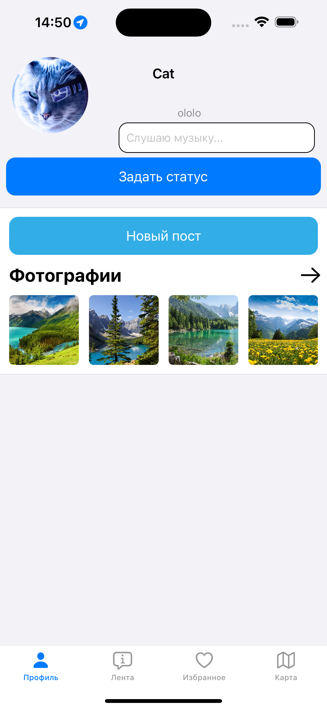
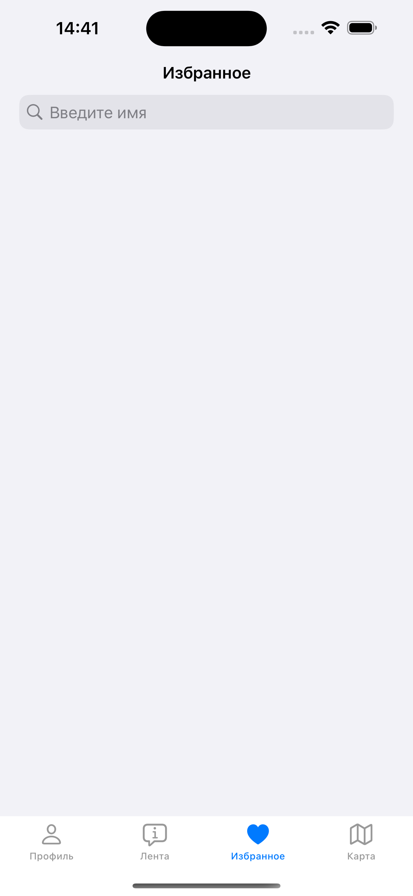
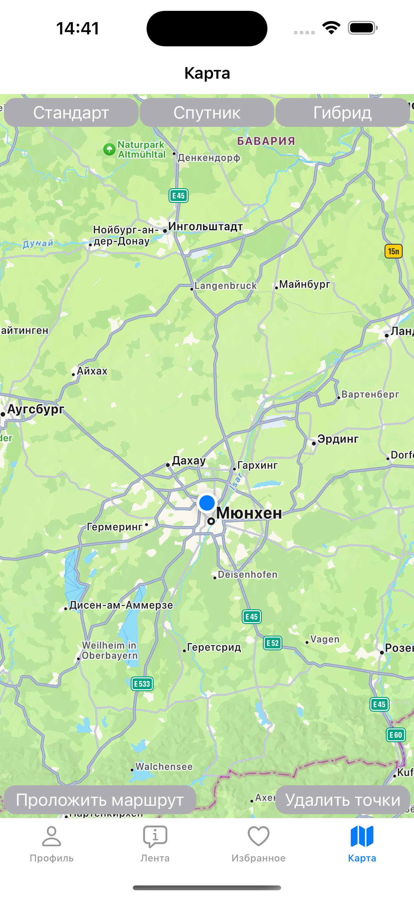

||||||
|:-:|:-:|:-:|:-:|:-:|

# Дипломная работа к профессии «iOS-разработчик»

Приложение социальной сети «Navigation».

В данном приложении реализованы функции регистрации, аутентификации пользователей, вход с помощью биометрии.

Пользователь имеет возможность создавать посты с фотографиями и текстом.

Имеется поддержка темной темы, а так же русского и английского языка.
